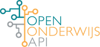

# Open Education API Specification



This repository contains the [OpenAPI](https://github.com/OAI/OpenAPI-Specification) (fka Swagger) specification for the [Open Education API](https://openonderwijsapi.nl/en/).

* [Roadmap](#roadmap)
* [Documentation](#documentation)
* [Development](#development)
* [Contributing](#contributing)
* [Community](#community)

If you have a question, an idea or some feedback unrelated to the specification, please visit the [community site](https://plus.google.com/communities/106455663981908394819).

Currently there are 2 main branches:

* [v2](https://github.com/open-education-api/specification/tree/v2) (Current version - final)
* [v1](https://github.com/open-education-api/specification/tree/v1) (Previous version - stale)


## Roadmap

These activities are planned for the next period:

* Discuss & process additions and improvements in separate v2 branch
* The scope of the V2 specification will be frozen by May 15, 2017
* The V2 specification will be finalized by the end of June 2017

## Documentation

The specification can be rendered as HTML documentation:

* [API Reference Documentation](https://rawgit.com/open-education-api/specification/v2/docs.html)

## Development

To render the reference documentation locally during development, you can start a [Docker](https://www.docker.com/community-edition/) container:

```
docker run --rm -p 8080:80 -v ${PWD}:/usr/share/nginx/html nginx:alpine
```

Now you can view the docs in your web browser: http://localhost:8080/docs.html

## Contributing

The Open Education API is an open source, community-driven project. If you'd like to contribute, please follow the [Contributing Guidelines](CONTRIBUTING.md).

## Community

The Open Education API is driven by the [Open Education API Working Group](https://openonderwijsapi.nl/en/community/). The working group includes representatives of higher education institutions and suppliers.
