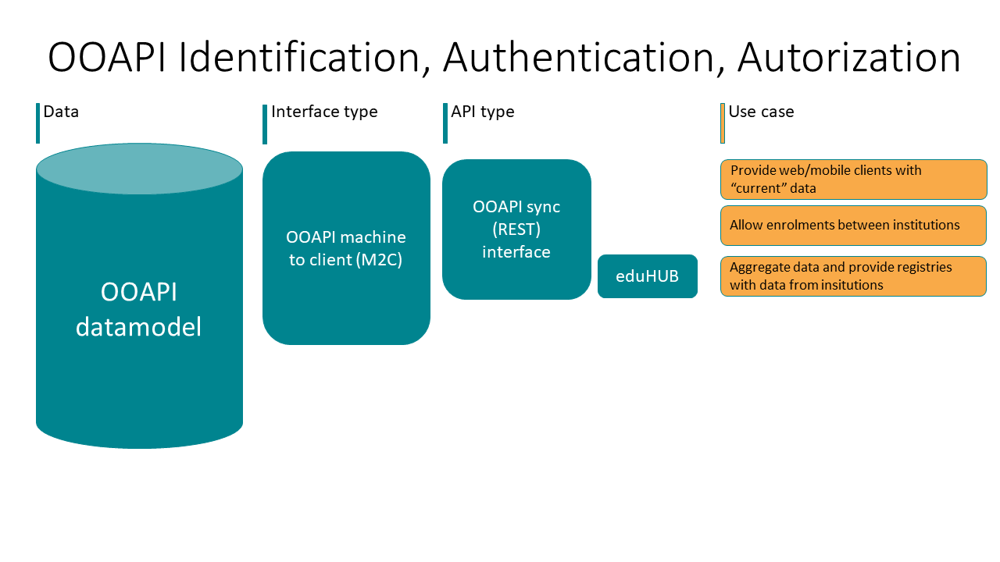

# IAA (Identification, Authentication and Authorization) 

Even though the name Open Education API would suggest all data provided by an API is open to the public, this should not be the case. The implementation of the different OOAPI end-points require different types of security. 

A usual implementation of OOAPI exposes internal (data) service endpoints for external consumption. This can be either through additional aggregation, eg. OOAPI gateway, or directly form the OOAPI endpoints form institutions (e.g. University of Leiden, or inHolland). The next figure provides an overview of components that are usually used.

## Minimal level of classification
Since the current OOAPIv40 implementation only provides information on a REST API, based on the [open API specification 3.0](https://swagger.io/specification/). We suggest API endpoints that have CIA scores above 'LLL' to implement security measures for accessing the endpoints. The types of security measures would depend on the sensitivity of the types of data exposed by the endpoint.

 

## Internet standards for Identification and authentication 
For handling identification and authentication either internal or external OIDC services are suggested. OIDC allows clients to verify the identity of the End-User based on the authentication performed by an Authorization Server, as well as to obtain basic profile information about the End-User in an interoperable and REST-like manner. More information on OIDC and OIDC flows can be found on the [OIDC website](https://openid.net/connect/)

[SURFConext also provides OIDC](https://wiki.surfnet.nl/display/surfconextdev/OpenID+Connect+basics). The OpenID Connect authentication flow supported by SURFconext can be found in the [SURFConext wiki](https://wiki.surfnet.nl/display/surfconextdev/OpenID+Connect+authentication+flow)

 

## Authorization at multiple levels

For handling authorization this is usually either business rule based which would be handled in the data services themselves or in the API manager when rules pertain to: 
* device
* key
* IP range 
* Throttling 

Of course the API manager itself could also have additional security measurements, such as firewalls, whitelisting for specific endpoints or Access Control Lists 

In the OOAPI IAA efforts we conform to the [IAA vision of SURF](https://www.surf.nl/visie-iaa-belangrijkste-trends-identiteitsstelsels)

In the eduXchange project the oAuth key of the student is used to exchange information on their behalf.  

