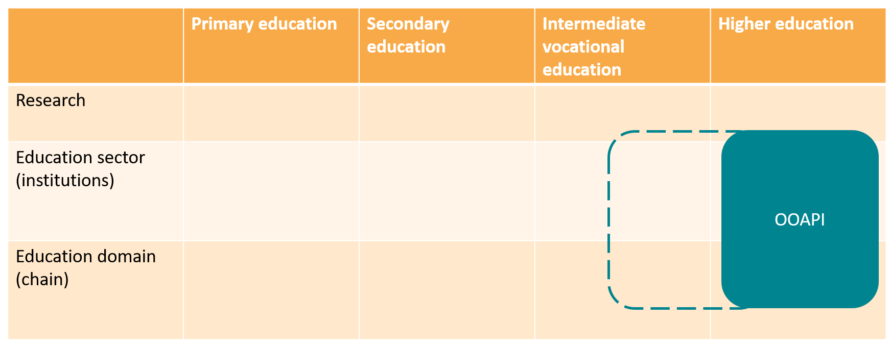

# Audience

The OOAPI workgroup consists of members of institutions for education, software suppliers of these members, as well as sectoral bodies such as [VH](https://www.vereniginghogescholen.nl/), [Universities of the Netherlands](https://www.universiteitenvannederland.nl/en_GB).

# Target audience
The working group is open for other members of other educational sectors.

Due to the scope of SURF these sectors are now limited to intermediate vocational education and Higher education (MBO/HBO, WO en UMC's). For other sectors to join the governance of the workgroup would need to be updated.
Currently there is interest from intermediate vocational education institutions to use the specification, see [program OKE](https://github.com/NetwerkExamineringDigitalisering/NED-OOAPI)
