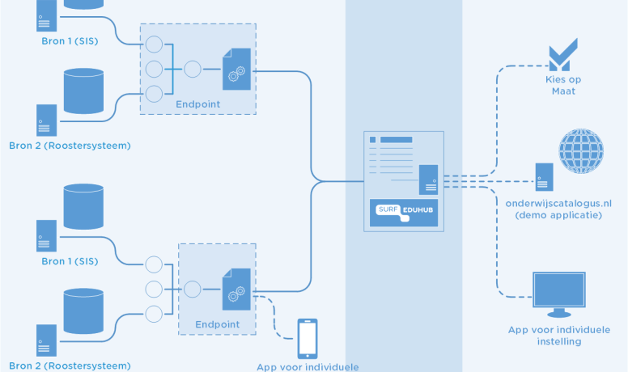

# OOAPI implementations

Currently the OOAPI is implemented at: universities for applied sciences, universities and super sectoral. An example of the latter is a tool implemented for the acceleration [zone flexible education](https://versnellingsplan.nl/english/zones/flexibilisation/). An other example of such super-sectoral implementations is the current development of the RIO adaptor and the eduHUB.

