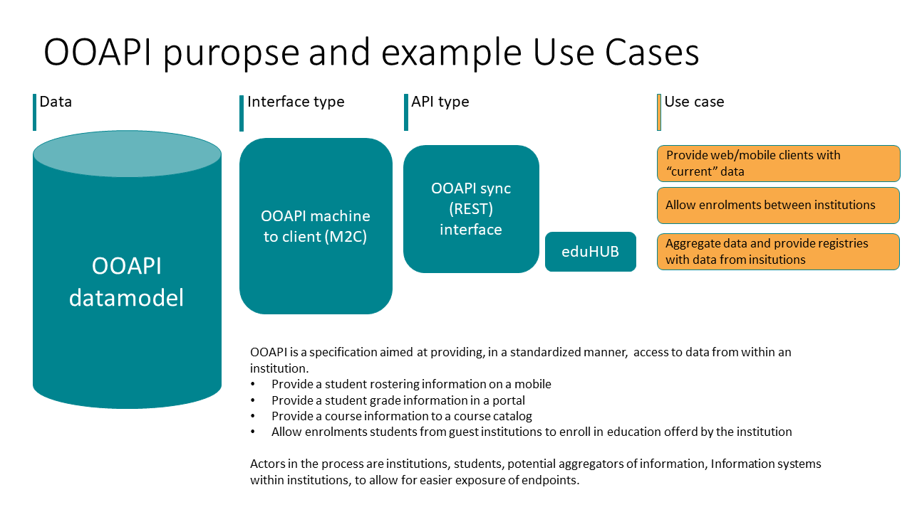

# OOAPI Purpose

The aim of the OOAPI specification is to standardise the information exchange from institutions using the API. This will allow builders of future applications to work with a well defined endpoint thus making it easier for integrations.

The current use case for the OOAPI v 5.0 is depicted in the figure below:

In the future more integrations might be created based on the OOAPI information model. 