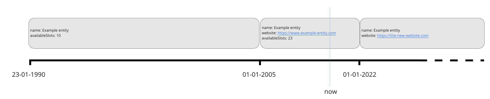

# Historic and future data

## timelineOverrides
OOAPI v5 adds a mechanism to communicate about data that was valid in the past or will become valid in the future. An implementation is expected to always return *the current value* of an entity as the main object in a response. To specify historic and future changes an an implementation can add one or more "timelineOverrides". Each timelineOverride is a repetition of the main objects, but with attributes that can have a different value or with absent optional attributes (indicating that an attribute did not exists in the past or will not exist in the future).

A timelineOverride also specifies a `startDate` and an `endDate` indicating for which period of time the changed attributes are valid.

>! The timelineOverride mechanism is only available when requesting single instances of either `EducationSpecification`, `Program` or `Course`. In future versions of the OOAPI specification this mechanism might be added to other entities as well.

## Usage
The timelineOverride mechanism consists of the following:
1. A `returnTimelineOverrides` (boolean) query parameter that allows clients to specifically request the timelineOverride information. The default is `false`, so clients have to explicitly set this to `true` to get historical and future data.
2. A `timelineOverrides` attribute in the `EducationSpecification`, `Program` and `Course` entities, which implementers can use to communicate historical and future versions of an entity.

## Example
In the following example `name` is a required field and so must be repeated in the timelineOverrides.



1. The first known state of events starts at 23-01-1990. The example entity has the following attributes:
    - name: Example entity
    - availableSlots: 10
2. From 01-01-2005 till 01-01-2022 (which happens to also encompass the current moment), the Example entity has a website, and the number of available slots has grown to 23:
    - name: Example entity
    - website: https://www.example-entity.com
    - availableSpots: 23
3. From 01-01-2022 and onwards (it is not yet known when the state will change again) the information about the availableSlots has been dropped and the website has changed:
    - name: Example entity
    - website: https://the-new-website.com

This sequence of changes can be specified in OOAPI as follows:

```json
{
    "name": "Example entity",
    "website: "https://www.example-entity.com",
    "availableSpots": 23,
    "validFrom": "01-01-2005",
    "validTo": "01-01-2022"
    "timelineOverrides": [
        {
            "startDate": "23-01-1990",
            "endDate": "01-01-2005",
            "entity": {
                "name": "Example entity",
                "availableSpots": 10
            }
        },
        {
            "startDate": "01-01-2022",
            "entity": {
                "name": "Example entity",
                "website": "https://the-new-website.com"
            }
        }
    ]
}
```
