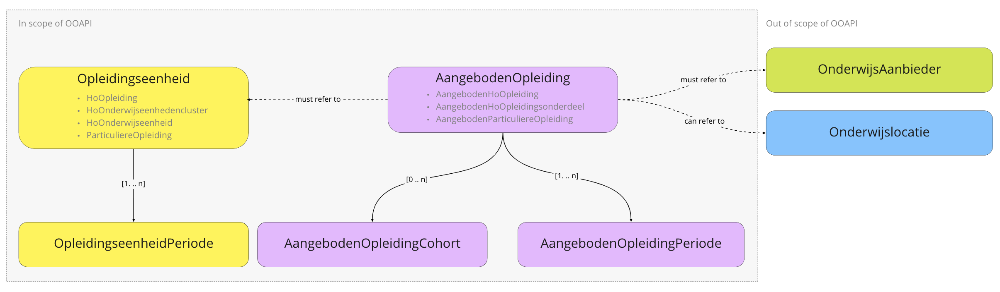
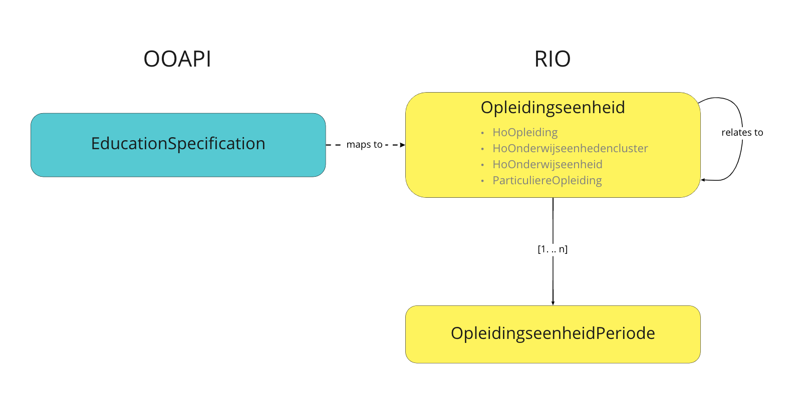
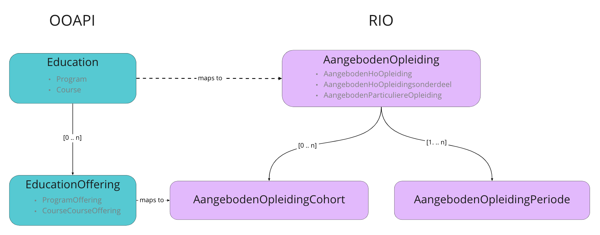

# RIO

RIO stands for [Register Instellingen en Opleidingen](https://www.rio-onderwijs.nl/). It is a Dutch national register provided by [DUO](https://www.duo.nl) in which educational institutions record three things: their educational offerings, how they are organized, and how to get in touch with them. DUO and other accrediting organizations record accreditations and licenses in RIO.

To support Dutch educational institutions with filling and maintaining their information in RIO, [SURF](https://www.surf.nl) provides SURFeduhub. [SURFeduhub](https://www.surf.nl/surfeduhub) is a platform for sharing educational data (using the OOAPI specification) between Dutch educational institutions (providers) and various consumers. RIO is one of the consumers supported by SURFeduhub.

To make the RIO functionality of SURFeduhub work an OOAPI implementation needs to implement the specific extensions as described on this page. When correctly implemented, the OOAPI base and the RIO extension provide a 1-to-1 mapping from the OOAPI model to the RIO model.

An educational institution needs to implement the following calls to be compatible with RIO:
- `GET /`
- `GET /education-specifications`
- `GET /education-specifications/{educationSpecificationId}`
- `GET /education-specifications/{educationSpecificationId}/education-specifications`
- `GET /education-specifications/{educationSpecificationId}/programs`
- `GET /education-specifications/{educationSpecificationId}/courses`
- `GET /programs`
- `GET /programs/{programId}`
- `GET /programs/{programId}/offerings`
- `GET /courses`
- `GET /courses/{courseId}`
- `GET /courses/{courseId}/offerings`

!> All calls returning collections need to support at least the `consumer` query parameter and should only return entities meant for RIO when this parameter is set to `rio`, e.g. `?consumer=rio`.

Furthermore, the returned entities should implement the attributes as described on this page. Some of this attributes are part of the additional "RIO Consumer object". See the general information about [specific consumers](consumers) for more information.

## Mapping OOAPI to RIO

### RIO Model

This is a simplified version of the RIO model. It leaves out a lot of details and only describes the parts that are relevant for the mapping from OOAPI to RIO. The following entities are in scope:
- OpleidingsEenheid, and the following specializations:
  - HoOpleiding
  - HoOnderwijseenhedenCluster
  - HoOnderwijseenheid
  - ParticuliereOpleiding (Non-formele opleiding)
- OpleidingsEenheidPeriode, and the following specializations:
  - HoOpleidingPeriode
  - HoOnderwijseenhedenClusterPeriode
  - HoOnderwijseenheidPeriode
  - ParticuliereOpleidingPeriode (Non-formele opleidingperiode)
- AangebodenOpleiding, and the following specializations:
  - AangebodenHoOpleiding
  - AangebodenHoOpleidingsOnderdeel
  - AangebodenHoParticuliereOpleiding (Aangeboden non-formele opleidingperiode)
- AangebodenOpleidingPeriode, and the following specializations:
  - AangebodenHoOpleidingPeriode
  - AangebodenHoOpleidingsOnderdeelPeriode
  - AangebodenHoParticuliereOpleidingPeriode (Aangeboden non-formele opleidingonderdeelperiode)
- AangebodenOpleidingCohort, and the following specializations:
  - AangebodenHoOpleidingCohort
  - AangebodenHoOpleidingsonderdeelCohort
  - AangebodenParticuliereOpleidingCohort (Aangeboden Non-formele opleidingcohort)

!> Out of scope are OnderwijsAanbieder and Onderwijslocatie. However at least an OnderwijsAanbider entity must exist in RIO before an AangebodenOpleiding can be created. Institution are responsible themselves to create OnderwijsAanbieder and Onderwijslocatie entities beforehand using the RIO web interface.

## Perioden and `timelineOverrides`

To be able to fill RIO it is necessary to be able to communicate about historic or future information regarding entities. RIO differentiates between attributes of an entity that remain stable for the lifetime of the entity and attributes whose values may change over time. The attributes that may change over time are grouped together in entities called "Perioden". Entities such as an OpleidingsEenheid and an AangebodenOpleiding must have *at least one* Periode. OOAPI however, is primarily meant to describe entities *as they are now*. Since v5.0 OOAPI has a mechanism to also specify historic and future versions of entities.

For RIO [this mechanism](historical-and-future-data) can be leveraged as follows:
- An OOAPI implementation is expected to always return the current values of attributes.
  - The subset of these *current* attributes that RIO considers *changeable over time* will constitute one Periode.
  - With start and end dates as specified by the attributes `validFrom` and `validTo`.
- For each historic or future Periode that an implementation wishes to communicate, a`timelineOverride` object must be added to the array of `timelineOverrides`.
  - Each `timelineOverride` will be translated to a Periode.
  - With start and end dates as specified by the attributes `startDate` and `endDate` from the `timelineOverride`.

## Mapping EducationSpecification to RIO Opleidingseenheden

EducationSpecifications can have relations to other EducationSpecifications which will be translated to RIO as relations between OpleidingsEenheden.

<!-- tabs:start -->

### **HoOpleiding**

| EducationSpecification                          | HoOpleiding                          | Enumeration mapping                            | Remarks                                                                                                                                                                                     |
| ----------------------------------------------- | ------------------------------------ | ---------------------------------------------- | ------------------------------------------------------------------------------------------------------------------------------------------------------------------------------------------- |
| *educationSpecificationType* [*]                |                                      |                                                | Determines whether this EducationSpecification maps to a HoOpleiding (program), HoOnderwijsEenhedenCluster (cluster), HoOnderwijsEenheid (course) or ParticuliereOpleiding (privateProgram) |
|                                                 | opleidingseenheidcode [0..1]         |                                                | Will be determined during transit.                                                                                                                                                          |
| validFrom                                       | beginDatum [1]                       |                                                |                                                                                                                                                                                             |
| validTo                                         | eindDatum [0..1]                     |                                                |                                                                                                                                                                                             |
| educationSpecificationId [*]                    | eigenOpleidingsEenheidSleutel [0..1] |                                                |                                                                                                                                                                                             |
| consumers › RIO › educationSpecificationSubType | soort [1]                            |                                                | If type is `program` and the subType field is absent `soort` will be set to `OPLEIDING`. If type is `program` and subType is set to `variant`, `soort` will be set to `VARIANT`.            |
| formalDocument                                  | waardedocumentsoort [1]              | [mapping](#formaldocument-waardedocumentsoort) |                                                                                                                                                                                             |
| level + sector                                  | niveau [1]                           | [mapping](#sector-level-niveau)                |                                                                                                                                                                                             |
| fieldsOfStudy                                   | ISCED [0..1]                         |                                                |                                                                                                                                                                                             |
| *timelineOverrides*                             | *HoOpleidingPeriode* [1..n]          |                                                | See also [Historical and future data](historical-and-future-data.md).                                                                                                                       |
| validFrom or timelineOverrides › startDate      | » beginDatum [1]                     |                                                |                                                                                                                                                                                             |
| name › nl-NL [*]                                | » naamLang [1]                       |                                                |                                                                                                                                                                                             |
| abbreviation                                    | » naamKort [0..1]                    |                                                |                                                                                                                                                                                             |
| name › en-** [*]                                | » internationaleNaam [0..1]          |                                                |                                                                                                                                                                                             |
| description › nl-NL                             | » omschrijving [0..1]                |                                                | RIO only allows plain text. OOAPI allows plain text and Markdown. NOTE: if for some reason HTML tags are present, RIO will reject the data.                                                 |
| studyload › value                               | » studielast [0..1]                  |                                                |                                                                                                                                                                                             |
| studyload › studyLoadUnit                       | » studielasteenheid [0..1]           | [mapping](#studyloadunit-studielasteenheid)    |                                                                                                                                                                                             |

> OOAPI fields marked with `[*]` are required fields in the OOAPI specification.

### **HoOnderwijsEenhedenCluster**

| EducationSpecification                          | HoOnderwijseenhedencluster                 | Enumeration mapping                            | Remarks                                                                                                                                                                                     |
| ----------------------------------------------- | ------------------------------------------ | ---------------------------------------------- | ------------------------------------------------------------------------------------------------------------------------------------------------------------------------------------------- |
| *educationSpecificationType* [*]                |                                            |                                                | Determines whether this EducationSpecification maps to a HoOpleiding (program), HoOnderwijsEenhedenCluster (cluster), HoOnderwijsEenheid (course) or ParticuliereOpleiding (privateProgram) |
|                                                 | opleidingseenheidcode [0..1]               |                                                | Will be determined during transit.                                                                                                                                                          |
| validFrom                                       | beginDatum [1]                             |                                                |                                                                                                                                                                                             |
| validTo                                         | eindDatum [0..1]                           |                                                |                                                                                                                                                                                             |
| educationSpecificationId [*]                    | eigenOpleidingsEenheidSleutel [0..1]       |                                                |                                                                                                                                                                                             |
| consumers › RIO › educationSpecificationSubType | soort [1]                                  |                                                | If type is `cluster`, this will always be set to `HOEC`.                                                                                                                                    |
| fieldsOfStudy                                   | ISCED [0..1]                               |                                                |                                                                                                                                                                                             |
| *timelineOverrides*                             | *HoOnderwijseenhedenclusterPeriode* [1..n] |                                                | See also [Historical and future data](historical-and-future-data.md).                                                                                                                       |
| validFrom or timelineOverrides › startDate      | » beginDatum [1]                           |                                                |                                                                                                                                                                                             |
| name › nl-NL [*]                                | » naamLang [1]                             |                                                |                                                                                                                                                                                             |
| abbreviation                                    | » naamKort [0..1]                          |                                                |                                                                                                                                                                                             |
| name › en-** [*]                                | » internationaleNaam [0..1]                |                                                |                                                                                                                                                                                             |
| description › nl-NL                             | » omschrijving [0..1]                      |                                                | RIO only allows plain text. OOAPI allows plain text and Markdown. NOTE: if for some reason HTML tags are present, RIO will reject the data.                                                 |
| formalDocument                                  | » waardedocumentsoort [0..1]               | [mapping](#formaldocument-waardedocumentsoort) |                                                                                                                                                                                             |
| studyload › value                               | » studielast [0..1]                        |                                                |                                                                                                                                                                                             |
| studyload › studyLoadUnit                       | » studielasteenheid [0..1]                 | [mapping](#studyloadunit-studielasteenheid)    |                                                                                                                                                                                             |

> OOAPI fields marked with `[*]` are required fields in the OOAPI specification.

### **HoOnderwijsEenheid**

| EducationSpecification                     | HoOnderwijseenheid                   | Enumeration mapping                            | Remarks                                                                                                                                                                                     |
| ------------------------------------------ | ------------------------------------ | ---------------------------------------------- | ------------------------------------------------------------------------------------------------------------------------------------------------------------------------------------------- |
| *educationSpecificationType* [*]           |                                      |                                                | Determines whether this EducationSpecification maps to a HoOpleiding (program), HoOnderwijsEenhedenCluster (cluster), HoOnderwijsEenheid (course) or ParticuliereOpleiding (privateProgram) |
|                                            | opleidingseenheidcode [0..1]         |                                                | Will be determined during transit.                                                                                                                                                          |
| validFrom                                  | beginDatum [1]                       |                                                |                                                                                                                                                                                             |
| validTo                                    | eindDatum [0..1]                     |                                                |                                                                                                                                                                                             |
| educationSpecificationId [*]               | eigenOpleidingsEenheidSleutel [0..1] |                                                |                                                                                                                                                                                             |
| fieldsOfStudy                              | ISCED [0..1]                         |                                                |                                                                                                                                                                                             |
| *timelineOverrides*                        | *HoOnderwijseenheidPeriode* [1..n]   |                                                | See also [Historical and future data](historical-and-future-data.md).                                                                                                                       |
| validFrom or timelineOverrides › startDate | » beginDatum [1]                     |                                                |                                                                                                                                                                                             |
| name › nl-NL [*]                           | » naamLang [1]                       |                                                |                                                                                                                                                                                             |
| abbreviation                               | » naamKort [0..1]                    |                                                |                                                                                                                                                                                             |
| name › en-** [*]                           | » internationaleNaam [0..1]          |                                                |                                                                                                                                                                                             |
| description › nl-NL                        | » omschrijving [0..1]                |                                                | RIO only allows plain text. OOAPI allows plain text and Markdown. NOTE: if for some reason HTML tags are present, RIO will reject the data.                                                 |
| formalDocument                             | » waardedocumentsoort [0..1]         | [mapping](#formaldocument-waardedocumentsoort) |                                                                                                                                                                                             |
| studyload › value                          | » studielast [0..1]                  |                                                |                                                                                                                                                                                             |
| studyload › studyLoadUnit                  | » studielasteenheid [0..1]           | [mapping](#studyloadunit-studielasteenheid)    |                                                                                                                                                                                             |

> OOAPI fields marked with `[*]` are required fields in the OOAPI specification.

### **ParticuliereOpleiding**

| EducationSpecification                     | ParticuliereOpleiding (Non-formeel)   | Enumeration mapping                            | Remarks                                                                                                                                                                                     |
| ------------------------------------------ | ------------------------------------- | ---------------------------------------------- | ------------------------------------------------------------------------------------------------------------------------------------------------------------------------------------------- |
| *educationSpecificationType* [*]           |                                       |                                                | Determines whether this EducationSpecification maps to a HoOpleiding (program), HoOnderwijsEenhedenCluster (cluster), HoOnderwijsEenheid (course) or ParticuliereOpleiding (privateProgram) |
|                                            | opleidingseenheidcode [0..1]          |                                                | Will be determined during transit.                                                                                                                                                          |
| validFrom                                  | beginDatum [1]                        |                                                |                                                                                                                                                                                             |
| validTo                                    | eindDatum [0..1]                      |                                                |                                                                                                                                                                                             |
| educationSpecificationId [*]               | eigenOpleidingsEenheidSleutel [0..1]  |                                                |                                                                                                                                                                                             |
| formalDocument                             | waardedocumentsoort [0..1]            | [mapping](#formaldocument-waardedocumentsoort) |                                                                                                                                                                                             |
| level + sector                             | niveau [0..1]                         | [mapping](#sector-level-niveau)                |                                                                                                                                                                                             |
| levelOfQualification                       | eqf [0..1]                            | [mapping](#levelofqualification-eqf)           | Level 4+ will be mapped to level 4.                                                                                                                                                         |
| levelOfQualification                       | nlqf [0..1]                           | [mapping](#levelofqualification-nlqf)          | Level 4+ will be mapped to level 4p.                                                                                                                                                        |
| consumers › category                       | categorie [0..3]                      | [mapping](#category-categorie)                 |                                                                                                                                                                                             |
| *timelineOverrides*                        | *ParticuliereOpleidingPeriode* [1..n] |                                                | See also [Historical and future data](historical-and-future-data.md).                                                                                                                       |
| validFrom or timelineOverrides › startDate | » beginDatum [1]                      |                                                |                                                                                                                                                                                             |
| name › nl-NL [*]                           | » naamLang [1]                        |                                                |                                                                                                                                                                                             |
| abbreviation                               | » naamKort [0..1]                     |                                                |                                                                                                                                                                                             |
| name › en** [*]                            | » internationaleNaam [0..1]           |                                                |                                                                                                                                                                                             |
| description › nl-NL                        | » omschrijving [0..1]                 |                                                | RIO only allows plain text. OOAPI allows plain text and Markdown. NOTE: if for some reason HTML tags are present, RIO will reject the data.                                                 |
| studyload › value                          | » studielast [0..1]                   |                                                |                                                                                                                                                                                             |
| studyload › studyLoadUnit                  | » studielasteenheid [0..1]            | [mapping](#studyloadunit-studielasteenheid)    |                                                                                                                                                                                             |

> OOAPI fields marked with `[*]` are required fields in the OOAPI specification.

<!-- tabs:end -->

## Mapping Educations to RIO AangebodenOpleidingen

### Mapping Program to RIO AangebodenOpleidingen

<!-- tabs:start -->

### **AangebodenHoOpleiding**

Notes:
- *The type of the `educationSpecification` this program refers to, determines whether this Program will be mapped to a AangebodenHoOpleiding, AangebodenHoOpleidingsonderdeel or AangebodenParticuliereOpleiding*
- *Cohorten will be mapped from the offerings belonging to the Program in question.*

| Program                                              | AangebodenHoOpleiding                        | Enumeration mapping                                          | Remarks                                                                                                                                                        |
| ---------------------------------------------------- | -------------------------------------------- | ------------------------------------------------------------ | -------------------------------------------------------------------------------------------------------------------------------------------------------------- |
| programId  [*]                                       | aangebodenOpleidingCode [1]                  |                                                              |                                                                                                                                                                |
| consumers › RIO › educationOffererCode               | onderwijsaanbiederCode [1]                   |                                                              |                                                                                                                                                                |
| consumers › RIO › educationLocationCode or addresses | onderwijslocatieCode [0..1]                  |                                                              | If `educationLocationCode` is absent and a single address of type `teaching` is present then a lookup will be attempted to determine the OnderwijslocatieCode. |
| validFrom                                            | begindatum [1]                               |                                                              |                                                                                                                                                                |
| firstStartDate                                       | eersteInstroomDatum [0..1]                   |                                                              |                                                                                                                                                                |
| validTo                                              | einddatum [0..1]                             |                                                              |                                                                                                                                                                |
| educationSpecification                               | opleidingeenheidSleutel [1]                  |                                                              | The `opleidingeenheidSleutel` will be determined by the educationSpecification this program is based on.                                                       |
| consumers › RIO › consentParticipationSTAP           | toestemmingDeelnameSTAP [1]                  | [mapping](#consentparticipationstap-toestemmingdeelnamestap) |                                                                                                                                                                |
| modeOfStudy                                          | vorm [1]                                     | [mapping](#modeofstudy-vorm)                                 | Programs where `modeOfStudy` is `self-paced` cannot be mapped to AangebodenHoOpleiding                                                                         |
| teachingLanguage [*]                                 | voertaal [0..1]                              | [mapping](#teachinglanguage-voertaal)                        |                                                                                                                                                                |
|                                                      | *AfwijkendeOpleidingsduur* [0..1]            |                                                              |                                                                                                                                                                |
| duration                                             | » opleidingsduurEenheid [1]                  |                                                              |                                                                                                                                                                |
| duration                                             | » opleidingsduurOmvang [1]                   |                                                              |                                                                                                                                                                |
| *timelineOverrides*                                  | *AangebodenHoOpleidingPeriode* [1..n]        |                                                              |                                                                                                                                                                |
| validFrom or timelineOverrides › startDate           | » begindatum [1]                             |                                                              |                                                                                                                                                                |
| name › nl-NL [*]                                     | » eigenNaamAangebodenOpleiding [0..1]        |                                                              |                                                                                                                                                                |
| name › en-** [*]                                     | » eigenNaamInternationaal [0..1]             |                                                              |                                                                                                                                                                |
| description › nl-NL [*]                              | » eigenOmschrijving [0..1]                   |                                                              | RIO only allows plain text. OOAPI allows plain text and Markdown. NOTE: if for some reason HTML tags are present, RIO will reject the data.                    |
| consumers › RIO › jointPartnerCodes                  | » samenwerkendeOnderwijsaanbiedercode [0..n] |                                                              |                                                                                                                                                                |
| consumers › RIO › deficiency                         | » deficientie [0..1]                         | [mapping](#deficiency-deficientie)                           |                                                                                                                                                                |
| consumers › RIO › acceleratedRoute                   | » versneldTraject [0..1]                     | [mapping](#acceleratedroute-versneldtraject)                 |                                                                                                                                                                |
| abbreviation [*]                                     | » eigenNaamKort [0..1]                       |                                                              |                                                                                                                                                                |
| consumers › RIO › propaedeuticPhase                  | » propedeutischeFase [1]                     | [mapping](#propaedeuticphase-propedeutischefase)             |                                                                                                                                                                |
| consumers › RIO › requirementsActivities             | » eisenWerkzaamheden [0..1]                  | [mapping](#requirementsactivities-eisenwerkzaamheden)        |                                                                                                                                                                |
| consumers › RIO › foreignPartners                    | » buitenlandsePartner [0..n]                 |                                                              |                                                                                                                                                                |
| consumers › RIO › studyChoiceCheck                   | » studiekeuzecheck [1]                       | [mapping](#studychoicecheck-studiekeuzecheck)                |                                                                                                                                                                |
| name › de-DE                                         | » internationaleNaamDuits [0..1]             |                                                              |                                                                                                                                                                |
| link                                                 | » website [0..1]                             |                                                              |                                                                                                                                                                |

> OOAPI fields marked with `[*]` are required fields in the OOAPI specification.

### **AangebodenHoOpleidingsonderdeel**

Notes:
- *The type of the `educationSpecification` this program refers to, determines whether this Program will be mapped to a AangebodenHoOpleiding, AangebodenHoOpleidingsonderdeel or AangebodenParticuliereOpleiding*
- *Cohorten will be mapped from the offerings belonging to the Program in question.*

| Program                                              | AangebodenHoOpleidingsonderdeel                 | Enumeration mapping                                          | Remarks                                                                                                                                                        |
| ---------------------------------------------------- | ----------------------------------------------- | ------------------------------------------------------------ | -------------------------------------------------------------------------------------------------------------------------------------------------------------- |
| programId [*]                                        | aangebodenOpleidingCode [1]                     |                                                              |                                                                                                                                                                |
| consumers › RIO › educationOffererCode               | onderwijsaanbiederCode [1]                      |                                                              |                                                                                                                                                                |
| consumers › RIO › educationLocationCode or addresses | onderwijslocatieCode [0..1]                     |                                                              | If `educationLocationCode` is absent and a single address of type `teaching` is present then a lookup will be attempted to determine the OnderwijslocatieCode. |
| validFrom                                            | begindatum [1]                                  |                                                              |                                                                                                                                                                |
| firstStartDate                                       | eersteInstroomDatum [0..1]                      |                                                              |                                                                                                                                                                |
| validTo                                              | einddatum [0..1]                                |                                                              |                                                                                                                                                                |
| educationSpecification                               | opleidingeenheidSleutel [1]                     |                                                              | The `opleidingeenheidSleutel` will be determined by the educationSpecification this program is based on.                                                       |
| consumers › RIO › consentParticipationSTAP           | toestemmingDeelnameSTAP [1]                     | [mapping](#consentparticipationstap-toestemmingdeelnamestap) |                                                                                                                                                                |
| teachingLanguage [*]                                 | voertaal [0..1]                                 | [mapping](#teachinglanguage-voertaal)                        |                                                                                                                                                                |
|                                                      | *AfwijkendeOpleidingsduur* [0..1]               |                                                              |                                                                                                                                                                |
| duration                                             | » opleidingsduurEenheid [1]                     |                                                              |                                                                                                                                                                |
| duration                                             | » opleidingsduurOmvang [1]                      |                                                              |                                                                                                                                                                |
| *timelineOverrides*                                  | *AangebodenHoOpleidingsonderdeelPeriode* [1..n] |                                                              |                                                                                                                                                                |
| validFrom or timelineOverrides › startDate           | » begindatum [1]                                |                                                              |                                                                                                                                                                |
| name › nl-NL [*]                                     | » eigenNaamAangebodenOpleiding [0..1]           |                                                              |                                                                                                                                                                |
| name › en-** [*]                                     | » eigenNaamInternationaal [0..1]                |                                                              |                                                                                                                                                                |
| description › nl-NL [*]                              | » eigenOmschrijving [0..1]                      |                                                              | RIO only allows plain text. OOAPI allows plain text and Markdown. NOTE: if for some reason HTML tags are present, RIO will reject the data.                    |
| consumers › RIO › jointPartnerCodes                  | » samenwerkendeOnderwijsaanbiedercode [0..n]    |                                                              |                                                                                                                                                                |
| abbreviation [*]                                     | » eigenNaamKort [0..1]                          |                                                              |                                                                                                                                                                |
| consumers › RIO › foreignPartners                    | » buitenlandsePartner [0..n]                    |                                                              |                                                                                                                                                                |
| link                                                 | » website [0..1]                                |                                                              |                                                                                                                                                                |

> OOAPI fields marked with `[*]` are required fields in the OOAPI specification.

### **AangebodenParticuliereOpleiding**

Notes:
- *The type of the `educationSpecification` this program refers to, determines whether this Program will be mapped to a AangebodenHoOpleiding, AangebodenHoOpleidingsonderdeel or AangebodenParticuliereOpleiding*
- *Cohorten will be mapped from the offerings belonging to the Program in question.*

| Program                                              | AangebodenParticuliereOpleiding (Non-formeel)   | Enumeration                                                  | Remarks                                                                                                                                                        |
| ---------------------------------------------------- | ----------------------------------------------- | ------------------------------------------------------------ | -------------------------------------------------------------------------------------------------------------------------------------------------------------- |
| programId [*]                                        | aangebodenOpleidingCode [1]                     |                                                              |                                                                                                                                                                |
| consumers › RIO › educationOffererCode               | onderwijsaanbiederCode [1]                      |                                                              |                                                                                                                                                                |
| consumers › RIO › educationLocationCode or addresses | onderwijslocatieCode [0..1]                     |                                                              | If `educationLocationCode` is absent and a single address of type `teaching` is present then a lookup will be attempted to determine the OnderwijslocatieCode. |
| validFrom                                            | begindatum [1]                                  |                                                              |                                                                                                                                                                |
| firstStartDate                                       | eersteInstroomDatum [0..1]                      |                                                              |                                                                                                                                                                |
| validTo                                              | einddatum [0..1]                                |                                                              |                                                                                                                                                                |
| educationSpecification                               | opleidingeenheidSleutel [1]                     |                                                              | The `opleidingeenheidSleutel` will be determined by the educationSpecification this program is based on.                                                       |
| level + sector                                       | niveau [0..1]                                   | [mapping](#sector-level-niveau)                              |                                                                                                                                                                |
| consumers › RIO › consentParticipationSTAP           | toestemmingDeelnameSTAP [1]                     | [mapping](#consentparticipationstap-toestemmingdeelnamestap) |                                                                                                                                                                |
| teachingLanguage [*]                                 | voertaal [0..1]                                 | [mapping](#teachinglanguage-voertaal)                        |                                                                                                                                                                |
|                                                      | *AfwijkendeOpleidingsduur* [0..1]               |                                                              |                                                                                                                                                                |
| duration                                             | » opleidingsduurEenheid [1]                     |                                                              |                                                                                                                                                                |
| duration                                             | » opleidingsduurOmvang [1]                      |                                                              |                                                                                                                                                                |
| *timelineOverrides*                                  | *AangebodenParticuliereOpleidingPeriode* [1..n] |                                                              |                                                                                                                                                                |
| validFrom or timelineOverrides › startDate           | » begindatum [1]                                |                                                              |                                                                                                                                                                |
| name › nl-NL [*]                                     | » eigenNaamAangebodenOpleiding [0..1]           |                                                              |                                                                                                                                                                |
| name › en-** [*]                                     | » eigenNaamInternationaal [0..1]                |                                                              |                                                                                                                                                                |
| description › nl-NL [*]                              | » eigenOmschrijving [0..1]                      |                                                              | RIO only allows plain text. OOAPI allows plain text and Markdown. NOTE: if for some reason HTML tags are present, RIO will reject the data.                    |
| consumers › RIO › jointPartnerCodes                  | » samenwerkendeOnderwijsaanbiedercode [0..n]    |                                                              |                                                                                                                                                                |
| link                                                 | » website [0..1]                                |                                                              |                                                                                                                                                                |

> OOAPI fields marked with `[*]` are required fields in the OOAPI specification.

<!-- tabs:end -->

### Mapping Course to RIO AangebodenHoOpleidingsonderdeel

*Note: Cohorten will be mapped from the offerings belonging to the Course in question.*

| Course                                               | AangebodenHoOpleidingsonderdeel                 | Enumeration mapping                                          | Remarks                                                                                                                                                        |
| ---------------------------------------------------- | ----------------------------------------------- | ------------------------------------------------------------ | -------------------------------------------------------------------------------------------------------------------------------------------------------------- |
| courseId [*]                                         | aangebodenOpleidingCode [1]                     |                                                              |                                                                                                                                                                |
| consumers › RIO › educationOffererCode               | onderwijsaanbiederCode [1]                      |                                                              |                                                                                                                                                                |
| consumers › RIO › educationLocationCode or addresses | onderwijslocatieCode [0..1]                     |                                                              | If `educationLocationCode` is absent and a single address of type `teaching` is present then a lookup will be attempted to determine the OnderwijslocatieCode. |
| validFrom                                            | begindatum [1]                                  |                                                              |                                                                                                                                                                |
| firstStartDate                                       | eersteInstroomDatum [0..1]                      |                                                              |                                                                                                                                                                |
| validTo                                              | einddatum [0..1]                                |                                                              |                                                                                                                                                                |
| educationSpecification                               | opleidingeenheidSleutel [1]                     |                                                              | The `opleidingeenheidSleutel` will be determined by the educationSpecification this program is based on.                                                       |
| consumers › RIO › consentParticipationSTAP           | toestemmingDeelnameSTAP [1]                     | [mapping](#consentparticipationstap-toestemmingdeelnamestap) |                                                                                                                                                                |
| teachingLanguage [*]                                 | voertaal [0..1]                                 | [mapping](#teachinglanguage-voertaal)                        |                                                                                                                                                                |
|                                                      | *AfwijkendeOpleidingsduur* [0..1]               |                                                              |                                                                                                                                                                |
| duration                                             | » opleidingsduurEenheid [1]                     |                                                              |                                                                                                                                                                |
| duration                                             | » opleidingsduurOmvang [1]                      |                                                              |                                                                                                                                                                |
| *timelineOverrides*                                  | *AangebodenHoOpleidingsonderdeelPeriode* [1..n] |                                                              |                                                                                                                                                                |
| validFrom or timelineOverrides › startDate           | » begindatum [1]                                |                                                              |                                                                                                                                                                |
| name › nl-NL [*]                                     | » eigenNaamAangebodenOpleiding [0..1]           |                                                              |                                                                                                                                                                |
| name › en-** [*]                                     | » eigenNaamInternationaal [0..1]                |                                                              |                                                                                                                                                                |
| description › nl-NL [*]                              | » eigenOmschrijving [0..1]                      |                                                              | RIO only allows plain text. OOAPI allows plain text and Markdown. NOTE: if for some reason HTML tags are present, RIO will reject the data.                    |
| consumers › RIO › jointPartnerCodes                  | » samenwerkendeOnderwijsaanbiedercode [0..n]    |                                                              |                                                                                                                                                                |
| abbreviation [*]                                     | » eigenNaamKort [0..1]                          |                                                              |                                                                                                                                                                |
| consumers › RIO › foreignPartners                    | » buitenlandsePartner [0..n]                    |                                                              |                                                                                                                                                                |
| link                                                 | » website [0..1]                                |                                                              |                                                                                                                                                                |

> OOAPI fields marked with `[*]` are required fields in the OOAPI specification.

### Mapping ProgramOffering and CourseOffering to RIO AangebodenHoOpleidingCohort, AangebodenHoOpleidingsonderdeelCohort and AangebodenParticuliereOpleidingCohort

*Note: Offerings will be mapped to Cohorten when the Programs or Courses they are part of are send to RIO.*

| ProgramOffering / CourseOffering                 | AangebodenOpleidingCohort                | Enumeration                                                                 | Remarks                                                                                                                                                           |
| ------------------------------------------------ | ---------------------------------------- | --------------------------------------------------------------------------- | ----------------------------------------------------------------------------------------------------------------------------------------------------------------- |
| offeringId [*]                                   | cohortCode [1]                           |                                                                             |                                                                                                                                                                   |
| consumers › RIO › registrationStatus             | cohortStatus [1]                         | [mapping](#registrationStatus-cohortstatus)                                 |                                                                                                                                                                   |
| enrollStartDate                                  | beginAanmeldperiode [1]                  |                                                                             |                                                                                                                                                                   |
| enrollEndDate                                    | eindeAanmeldperiode [0..1]               |                                                                             |                                                                                                                                                                   |
| consumers › RIO › requiredPermissionRegistration | toestemmingVereistVoorAanmelding [0..1]  | [mapping](#requiredpermissionregistration-toestemmingvereistvooraanmelding) |                                                                                                                                                                   |
| consumers › RIO › explanationRequiredPermission  | toelichtingVereisteToestemming [0..1]    |                                                                             |                                                                                                                                                                   |
| validTo                                          | einddatum [0..1]                         |                                                                             |                                                                                                                                                                   |
| maxNumberStudents                                | deelnemersplaatsen [0..1]                |                                                                             |                                                                                                                                                                   |
| modeOfDelivery                                   | opleidingsvorm [1]                       | [mapping](#modeofdelivery-opleidingsvorm)                                   | Only offerings with `modeOfDelivery` set to `online`, `hybrid` or `situated` can be mapped to Cohorten.                                                           |
| *priceInformation*                               | *prijs* [0..n]                           |                                                                             |                                                                                                                                                                   |
| costType                                         | » soort [1]                              | [mapping](#costtype-soort)                                                  |                                                                                                                                                                   |
| amount                                           | » bedrag [1]                             |                                                                             |                                                                                                                                                                   |
|                                                  | *ChoiceCohortInstroomsoort* (choice)     |                                                                             | When an offering has the attribute `flexibleEntryPeriodStart` set, the attribute `startDate` will be ignored and the Cohort will get a 'flexibel instroommoment'. |
| startDate [*]                                    | » (vast) instroommoment [1]              |                                                                             |                                                                                                                                                                   |
| flexibleEntryPeriodStart                         | » (flexibel) beginInstroomperiode [1]    |                                                                             |                                                                                                                                                                   |
| flexibleEntryPeriodEnd                           | » (flexibel) eindeInstroomperiode [0..1] |                                                                             |                                                                                                                                                                   |

> OOAPI fields marked with `[*]` are required fields in the OOAPI specification.

## Enumeration mappings

### formalDocument › waardedocumentsoort   	

| formalDocument       | waardedocumentsoort     |
| -------------------- | ----------------------- |
| diploma              | DIPLOMA                 |
| certificate          | CERTIFICAAT             |
| no official document | GEEN_OFFICIEEL_DOCUMENT |
| school advice        | SCHOOLADVIES            |
| testimonial          | GETUIGSCHRIFT           |

### Sector + level › niveau

| level / sector                   | secondary vocational education | higher professional education | university education |
| -------------------------------- | ------------------------------ | ----------------------------- | -------------------- |
| secondary vocational education   | MBO                            |                               |                      |
| secondary vocational education 1 | MBO-1                          |                               |                      |
| secondary vocational education 2 | MBO-2                          |                               |                      |
| secondary vocational education 3 | MBO-3                          |                               |                      |
| secondary vocational education 4 | MBO-4                          |                               |                      |
| associate degree                 |                                | HBO-AD                        |                      |
| bachelor                         |                                | HBO-BA                        | WO-BA                |
| master                           |                                | HBO-MA                        | WO-MA                |
| doctoral                         |                                | HBO-PM                        | WO-PM                |
| undefined                        | ONBEPAALD                      | ONBEPAALD                     | ONBEPAALD            |
| undivided                        |                                | HBO-O                         | WO-O                 |
| nt2-1                            | NT2-I                          | NT2-I                         | NT2-I                |
| nt2-2                            | NT2-II                         | NT2-II                        | NT2-II               |

The following level cannot be mapped from OOAPI to RIO:
- EDUCATIE

### modeOfDelivery › opleidingsvorm

| modeOfDelivery    | opleidingsvorm       | remarks           |
| ----------------- | -------------------- | ----------------- |
| distance-learning |                      | Cannot map to RIO |
| on campus         |                      | Cannot map to RIO |
| online            | ONLINE               |                   |
| hybrid            | KLASSIKAAL_EN_ONLINE |                   |
| situated          | KLASSIKAAL           |                   |
|                   | LEZING               | Cannot map to RIO |
|                   | ZELFSTUDIE           | Cannot map to RIO |
|                   | COACHING             | Cannot map to RIO |

### studyLoadUnit › studielasteenheid

| studyLoadUnit | studielasteenheid |
| ------------- | ----------------- |
| contacttime   | CONTACTUUR        |
| ects          | ECTS_PUNT         |
| sbu           | SBU               |
| sp            | STUDIEPUNT        |
| hour          | UUR               |

### levelOfQualification › eqf

| levelOfQualification | eqf |
| -------------------- | --- |
| 1                    | 1   |
| 2                    | 2   |
| 3                    | 3   |
| 4                    | 4   |
| 4+                   | 4   |
| 5                    | 5   |
| 6                    | 6   |
| 7                    | 7   |
| 8                    | 8   |

### levelOfQualification › nlqf

| levelOfQualification | nlqf |
| -------------------- | ---- |
| 1                    | 1    |
| 2                    | 2    |
| 3                    | 3    |
| 4                    | 4    |
| 4+                   | 4p   |
| 5                    | 5    |
| 6                    | 6    |
| 7                    | 7    |
| 8                    | 8    |

### consentParticipationSTAP › toestemmingDeelnameSTAP

| consentParticipationSTAP | toestemmingDeelnameSTAP   |
| ------------------------ | ------------------------- |
| permission_granted       | GEEN_TOESTEMMING_VERLEEND |
| permission_not_granted   | TOESTEMMING_VERLEEND      |

### modeOfStudy › vorm

| modeOfStudy   | vorm     | Remarks                  |
| ------------- | -------- | ------------------------ |
| full-time     | VOLTIJD  |                          |
| part-time     | DEELTIJD |                          |
| dual training | DUAAL    |                          |
| self-paced    |          | Cannot be mapped to RIO. |

### teachingLanguage › voertaal

See also [this overview of language tags](https://www.loc.gov/standards/iso639-2/php/English_list.php).

| teachingLanguage | voertaal |
| ---------------- | -------- |
| ara              | ARA      |
| chi              | CHI      |
| deu              | DEU      |
| eng              | ENG      |
| fra              | FRA      |
| hrv              | HRV      |
| ita              | ITA      |
| jpn              | JPN      |
| nld              | NLD      |
| nor              | NOR      |
| pap              | PAP      |
| pol              | POL      |
| por              | POR      |
| ron              | RON      |
| rus              | RUS      |
| spa              | SPA      |
| swe              | SWE      |
| tur              | TUR      |

### deficiency › deficientie

| deficiency      | deficientie       |
| --------------- | ----------------- |
| deficiencies    | DEFICIENTIES      |
| no_deficiencies | GEEN_DEFICIENTIES |

### acceleratedRoute › versneldTraject

| acceleratedRoute     | versneldTraject       |
| -------------------- | --------------------- |
| accelerated_route    | VERSNELD_TRAJECT      |
| no_accelerated_route | GEEN_VERSNELD_TRAJECT |

### propaedeuticPhase › propedeutischeFase

| propaedeuticPhase          | propedeutischeFase                |
| -------------------------- | --------------------------------- |
| no_propaedeutic_phase      | GEEN_PROPEDEUTISCHE_FASE          |
| propaedeutic_phase_exam    | PROPEDEUTISCHE_FASE_EXAMEN        |
| propaedeutic_phase_no_exam | PROPEDEUTISCHE_FASE_ZONDER_EXAMEN |

### requirementsActivities › eisenWerkzaamheden

| requirementsActivities | eisenWerkzaamheden |
| ---------------------- | ------------------ |
| requirements           | EISEN              |
| no_requirements        | GEEN_EISEN         |

### studyChoiceCheck › studiekeuzecheck

| studyChoiceCheck             | studiekeuzecheck                 |
| ---------------------------- | -------------------------------- |
| no_study_choice_check        | GEEN_STUDIEKEUZE_CHECK           |
| study_choice_check_available | STUDIEKEUZE_CHECK_VAN_TOEPASSING |
| study_choice_check_mandatory | STUDIEKEUZE_CHECK_VERPLICHT      |

### registrationStatus › cohortStatus

| registrationStatus | cohortStatus |
| ------------------ | ------------ |
| open               | O            |
| closed             | G            |

### requiredPermissionRegistration › toestemmingVereistVoorAanmelding

| requiredPermissionRegistration | toestemmingVereistVoorAanmelding |
| ------------------------------ | -------------------------------- |
| yes                            | JA                               |
| no                             | NEE                              |

### costType › soort

| costType      | soort                      |
| ------------- | -------------------------- |
| STAP eligible | TOTAAL_STAP_SUBSIDIEERBAAR |
| total costs   | TOTALE_VERPLICHTE_KOSTEN   |

### category › categorie

| category                                 | categorie                                |
| ---------------------------------------- | ---------------------------------------- |
| business_and_project_support             | BEDRIJFS_EN_PROJECTONDERSTEUNING         |
| economy                                  | ECONOMIE                                 |
| behavior_and_society                     | GEDRAG_EN_MAATSCHAPPIJ                   |
| healthcare_and_sport                     | GEZONDHEID_ZORG_EN_SPORT                 |
| hobby_and_leisure_time                   | HOBBY_EN_VRIJE_TIJD                      |
| agriculture_food_and_natural_environment | LANDBOUW_VOEDSEL_EN_NATUURLIJKE_OMGEVING |
| management_and_project_management        | MANAGEMENT_EN_PROJECTMANAGEMENT          |
| nature                                   | NATUUR                                   |
| education                                | ONDERWIJS                                |
| law                                      | RECHT                                    |
| cross_sectoral                           | SECTOROVERSTIJGEND                       |
| language_and_culture                     | TAAL_EN_CULTUUR                          |
| technology_and_ict                       | TECHNIEK_EN_ICT                          |
| tourism_hospitality_and_recreation       | TOERISME_HORECA_EN_RECREATIE             |
| transport_and_logistics                  | TRANSPORT_EN_LOGISTIEK                   |
| security_and_defense                     | VEILIGHEID_EN_DEFENSIE                   |
