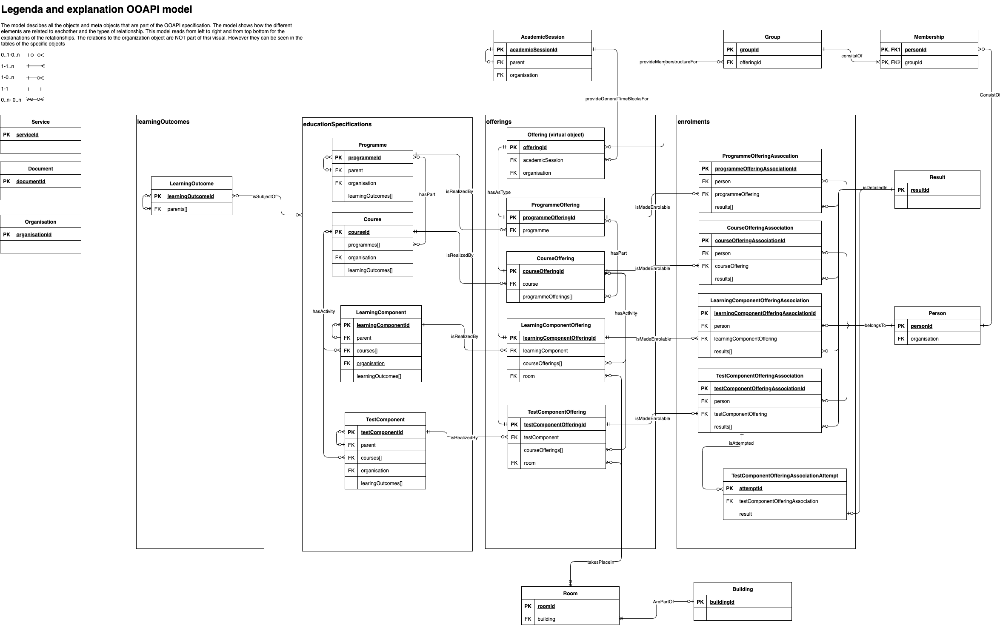

# OOAPI2 Information Model

OpenAPI (fka Swagger) specification for the Open Education API.

The specification can be downloaded as a whole in yaml]<a href="../oeapi.yaml" download>yaml</a>
and in <a href="../oeapi.json" download>json</a>

<figure>
  <a target="_blank" href="../source/ooapi_v6.png">
  
  </a>
  <figcaption> OOAPI information model that feeds OOAPI specification (click to enlage)</figcaption>
</figure>

## Model

The model provides an overview of the educational domain that is modelled and
forms the basis of the OOAPI. The overarching educational concept is not exposed
through API endpoints. Instead, the educational specification defines four base
objects: programme, course, learning component, and test component, each with
its own endpoint.

These base objects can be used to realise offerings. There is, however, no
dedicated offering endpoint. Offerings are represented through four base
types: programme offering, course offering, learning component offering, and
test component offering.

Relations between an offering and a person, such as enrolment, are realised
through association endpoints. These endpoints define the different types of
associations that can exist between offerings and persons. Other objects shown
in the model represent groups and group memberships of a person.

The original file for this model can be found <a target="_blank" href="../source/ooapi_v6_latest.drawio">here</a>

The programme relations object is not found as a separate endpoint but relations between programmes can be found within the programme endpoint by expanding that endpoint.

## Relationship Definitions

Definitions for all relationships in the model:

| Entities                                                                                                                                                                                         | Relationship             | Cardinality | Description                                                                                                                                       |
| -------------------------------------------------------------------------------------------------------------------------------------------------------------------------------------------------| ------------------------ | ----------- | ------------------------------------------------------------------------------------------------------------------------------------------------- |
| **Learning Outcomes**                                                                                                                                                                            |                          |             |                                                                                                                                                   |
| LearningOutcome ↔ Programme, Course, LearningComponent, TestComponent                                                                                                                            | achieves                 | \* : \*       | Educational entities are designed to achieve specific learning outcomes that define the knowledge, skills, and competencies students will acquire |
| LearningOutcome ↔ LearningOutcome                                                                                                                                                                | has parents              | \* : \*       | Learning outcomes can be organised hierarchically, where specific outcomes are grouped under broader outcomes                                     |
| **Organisational Structure**                                                                                                                                                                     |                          |             |                                                                                                                                                   |
| Organisation → Organisation                                                                                                                                                                      | has parent               | \* : 0..1    | Organisations can be structured hierarchically (departments → faculties → institutions), creating a tree structure                                |
| Organisation ↔ LearningOutcome, Programme, Course, LearningComponent, TestComponent, ProgrammeOffering, CourseOffering, LearningComponentOffering, TestComponentOffering, Group, AcademicSession | provides/manages/defines | 1 : \*       | Organisations own and administer educational entities, manage operational delivery of offerings, oversee groups, and define academic sessions     |
| **Educational Structure**                                                                                                                                                                        |                          |             |                                                                                                                                                   |
| Programme → Programme                                                                                                                                                                            | has parent               | \* : 0..1    | Programmes can be nested (specializations, tracks, minors within main programmes)                                                                 |
| Programme ↔ Course                                                                                                                                                                               | composed of              | \* : \*       | Courses can be included in multiple programmes (core in some, electives in others)                                                                |
| Course → LearningComponent, TestComponent                                                                                                                                                        | composed of              | 1 : \*       | Components are the constituent parts of a course - the building blocks (lectures, tutorials, exams) that together form the complete course        |
| **Educational Offerings**                                                                                                                                                                        |                          |             |                                                                                                                                                   |
| Programme → ProgrammeOffering                                                                                                                                                                    | offered as               | 1 : \*       | A programme can have multiple offerings for different cohorts or start dates                                                                      |
| Course → CourseOffering                                                                                                                                                                          | offered as               | 1 : \*       | A course can have multiple offerings for different times, locations, or delivery modes                                                            |
| LearningComponent → LearningComponentOffering                                                                                                                                                    | offered as               | 1 : \*       | A component can have multiple scheduled instances                                                                                                 |
| TestComponent → TestComponentOffering                                                                                                                                                            | offered as               | 1 : \*       | A test can have multiple scheduled exam sessions                                                                                                  |
| **Offering Relationships**                                                                                                                                                                       |                          |             |                                                                                                                                                   |
| ProgrammeOffering ↔ CourseOffering                                                                                                                                                               | includes                 | \* : \*       | Course offerings are part of programme offerings, indicating which courses are being delivered within that specific programme instance            |
| CourseOffering ↔ LearningComponentOffering, TestComponentOffering                                                                                                                                | includes                 | \* : \*       | Component offerings are the scheduled instances that together deliver a course offering                                                           |
| **Scheduling & Location**                                                                                                                                                                        |                          |             |                                                                                                                                                   |
| AcademicSession → ProgrammeOffering, CourseOffering, LearningComponentOffering, TestComponentOffering                                                                                            | scheduled in             | 1 : \*       | Each offering occurs within a specific academic session defining its temporal boundaries                                                          |
| AcademicSession → AcademicSession                                                                                                                                                                | has parent               | \* : 0..1    | Academic sessions can be nested (quarters within semesters, weeks within terms)                                                                   |
| LearningComponentOffering, TestComponentOffering → Room                                                                                                                                          | takes place in           | \* : 0..1    | Each component offering is assigned to a specific physical, virtual or no room                                                                    |
| Room → Building                                                                                                                                                                                  | located in               | \* : 1       | Each room exists within exactly one building                                                                                                      |
| **Enrolments (Associations)**                                                                                                                                                                    |                          |             |                                                                                                                                                   |
| Person → ProgrammeOfferingAssociation, CourseOfferingAssociation, LearningComponentOfferingAssociation, TestComponentOfferingAssociation                                                         | enrolled via             | 1 : 1       | Person's enrolment/participation in offerings at various levels (programme, course, component, test) with role and status                         |
| ProgrammeOffering → ProgrammeOfferingAssociation                                                                                                                                                 | has enrolments           | 1 : \*       | Each ProgrammeOffering can have multiple enrolled persons                                                                                          |
| CourseOffering → CourseOfferingAssociation                                                                                                                                                       | has enrolments           | 1 : \*       | Each CourseOffering can have multiple enrolled persons                                                                                             |
| LearningComponentOffering → LearningComponentOfferingAssociation                                                                                                                                 | has enrolments           | 1 : \*       | Each LearningComponentOffering can have multiple enrolled persons                                                                                  |
| TestComponentOffering → TestComponentOfferingAssociation                                                                                                                                         | has enrolments           | 1 : \*       | Each TestComponentOffering can have multiple enrolled persons                                                                                      |
| **Results**                                                                                                                                                                                      |                          |             |                                                                                                                                                   |
| ProgrammeOfferingAssociation, CourseOfferingAssociation, LearningComponentOfferingAssociation, TestComponentOfferingAssociation, TestComponentOfferingAssociationAttempt → Result                | has                      | 1 : 0..1    | Associations may have results representing grades or completion status (optional for active enrolments)                                           |
| **Groups & Memberships**                                                                                                                                                                         |                          |             |                                                                                                                                                   |
| Group → AcademicSession                                                                                                                                                                          | active during            | 1 : 1       | Groups are associated with specific academic sessions indicating when they are active                                                             |
| Group ↔ ProgrammeOffering, CourseOffering, LearningComponentOffering, TestComponentOffering                                                                                                      | related to               | \* : \*       | Groups can be related to offerings                                                                                                                |
| Person → Membership                                                                                                                                                                              | has                      | 1 : \*       | A membership represents one person's membership of a group                                                                                        |
| Group → Membership                                                                                                                                                                               | contains                 | 1 : \*       | Each group can have multiple members                                                                                                              |

## Notes

Notes:
- Cardinality notation: `Source : Target` where `*` = many (0 or more), `1` = exactly one, `0..1` = zero or one
- Bidirectional relationships (↔) indicate many-to-many relationships that can be traversed in both directions
- Some relationships are implemented through junction entities (e.g., Associations for enrolments)
- The "offered as" relationships connect abstract educational entities to their concrete scheduled instances
- Organisation acts as a central entity providing and managing most other entities in the system

## Background Information

Information about earlier meetings and presentations can be found <a target="_blank" href="https://github.com/open-education-api/notulen">here</a>

Information on the EDU-API model that was also used for this api is shown <a target="_blank" href="../source/eduapi.png">here</a>

## API Paths

The following paths are described in the model:

```
- / (The service endpoint)
- /academic-sessions
- /academic-sessions/\{academicSessionId\}
- /academic-sessions/\{academicSessionId\}/course-offerings
- /academic-sessions/\{academicSessionId\}/learning-component-offerings
- /academic-sessions/\{academicSessionId\}/programme-offerings
- /academic-sessions/\{academicSessionId\}/test-component-offerings
- /buildings
- /buildings/\{buildingId\}
- /buildings/\{buildingId\}/rooms
- /course-offering-associations/\{courseOfferingAssociationId\}
- /course-offering-associations/external/me
- /course-offerings/\{courseOfferingId\}
- /course-offerings/\{courseOfferingId\}/course-offering-associations
- /course-offerings/\{courseOfferingId\}/groups
- /courses
- /courses/\{courseId\}
- /courses/\{courseId\}/course-offerings
- /courses/\{courseId\}/learning-component-offerings
- /courses/\{courseId\}/learning-components
- /courses/\{courseId\}/test-component-offerings
- /courses/\{courseId\}/test-components
- /documents/\{documentId\}
- /groups
- /groups/\{groupId\}
- /groups/\{groupId\}/memberships
- /groups/\{groupId\}/memberships/\{personId\}
- /learning-component-offering-associations/\{learningComponentOfferingAssociationId\}
- /learning-component-offerings/\{learningComponentOfferingId\}
- /learning-component-offerings/\{learningComponentOfferingId\}/groups
- /learning-components/\{learningComponentId\}
- /learning-components/\{learningComponentId\}/learning-component-offerings
- /learning-outcomes
- /learning-outcomes/\{learningOutcomeId\}
- /organisations
- /organisations/\{organisationId\}
- /organisations/\{organisationId\}/course-offerings
- /organisations/\{organisationId\}/courses
- /organisations/\{organisationId\}/groups
- /organisations/\{organisationId\}/learning-component-offerings
- /organisations/\{organisationId\}/learning-components
- /organisations/\{organisationId\}/programme-offerings
- /organisations/\{organisationId\}/programmes
- /organisations/\{organisationId\}/test-component-offerings
- /organisations/\{organisationId\}/test-components
- /persons
- /persons/\{personId\}
- /persons/\{personId\}/course-offering-associations
- /persons/\{personId\}/learning-component-offering-associations
- /persons/\{personId\}/programme-offering-associations
- /persons/\{personId\}/test-component-offering-associations
- /persons/me
- /programme-offering-associations/\{programmeOfferingAssociationId\}
- /programme-offering-associations/external/me
- /programme-offerings/\{programmeOfferingId\}
- /programme-offerings/\{programmeOfferingId\}/groups
- /programme-offerings/\{programmeOfferingId\}/programme-offering-associations
- /programmes
- /programmes/\{programmeId\}
- /programmes/\{programmeId\}/courses
- /programmes/\{programmeId\}/programme-offerings
- /programmes/\{programmeId\}/programmes
- /rooms
- /rooms/\{roomId\}
- /test-component-offering-associations/\{testComponentOfferingAssociationId\}
- /test-component-offerings/\{testComponentOfferingId\}
- /test-component-offerings/\{testComponentOfferingId\}/groups
- /test-components/\{testComponentId\}
- /test-components/\{testComponentId\}/test-component-offerings
```
