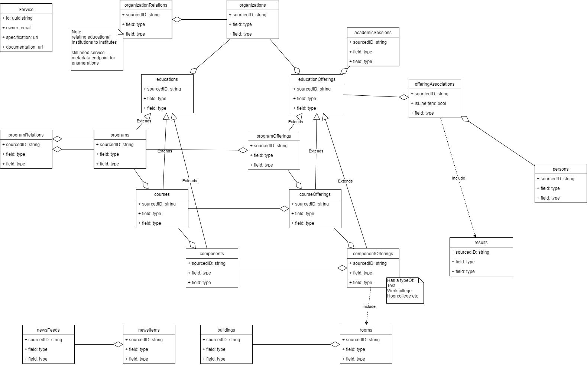

# Changes in update 3.x to 4.0 Education API Specification

The biggest changes between 3.0 and 4.0 are in the endpoints supported and the model that is used to create the new 4.0 specification

The 3.x model is based on:

the 4.0 model is based on:

## Guidelines

* The 4.0 version will be implementing [the Dutch api strategy](https://docs.geostandaarden.nl/api/API-Strategie/)
* With one adoption: Language used: US English

The 4.0 model is partialy based on the IMS eduAPI model which is currently still in development. The most important change in th 4.0 model is the introduction of the table of nine

| Object    | Object in time    | Object in time related to a person|
|---------- | ----------------- | --------------------------------- |
| Program   | ProgramOffering   | ProgramOfferingAssociation        | 
| Course    | CourseOffering    | CourseOfferingAssociation         |
| Component | ComponentOffering | ComponentOfferingAssociation      |

