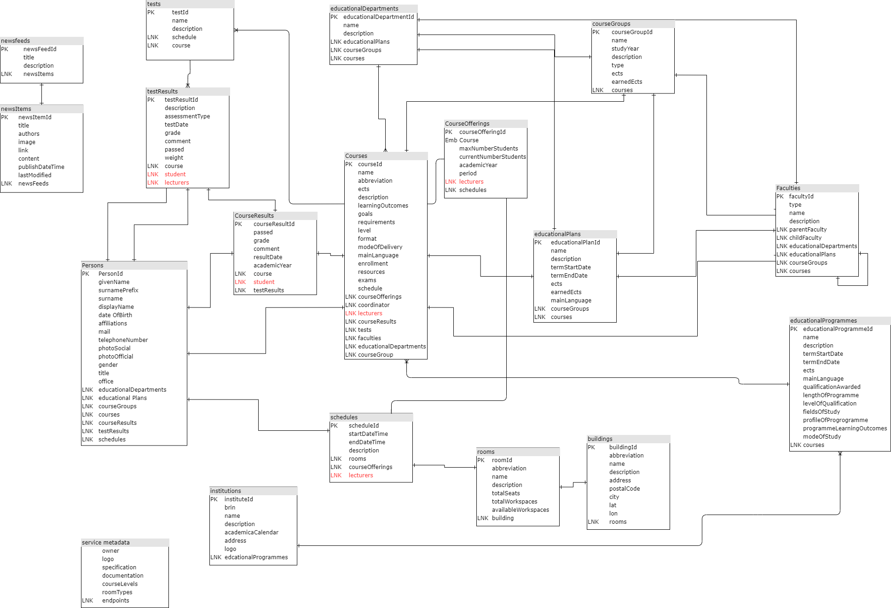

# Changes in update 3.x to 4.0 Education API Specification

The OOAPI-specification is finding more use cases. This causes the model to grow and also to change in certain aspects.

New area's of implementation are:
* Student mobility (to allow students to enroll for courses at guest institutions)
* Combined calanders for students (to allow students access to information from multiple institutions)
* Course catalogs, to provide students with information on the types of courses that are available at a given institution at a given time.

The biggest changes between 3.0 and 4.0 are in the supported endpoints, and the model that that serves as the basis for the new 4.0 specification. Some of the earlier objects have been removed, others objects have grown and can now provide more information (for example the person object, which can now have a larger payload).

## Models
The 3.x model is based on:

the 4.0 model is based on:

## Guidelines

* The 4.0 version will be implementing [the Dutch api strategy](https://docs.geostandaarden.nl/api/API-Strategie/)
* With one adoption: the language used is **US English**

The values for some attributues are also more restricted by using enumerations. At the moment these enumerations are still being discussed. You can join in on the discussion [here](https://github.com/open-education-api/specification/issues/90)

## More filters

Another addition to 4.0 are mulptile filters to limit the returned objects to those that are of interest to the client. This enables the creation of richer user interfaces. Responses can be filtered on specific attributes, but also with a more generic **q** query parameter, which allows for text matching on name and description attributes.

## Extension object

In 4.0, all objects in a response have the **ext** attribute with type **object**. This attributes is meant for institution-level extensions. If a use case for a specific institution calls for attributes that are not in the OOAPI specification, they can be added here.

## Expand option

Some requests in 4.0 have an optional **expand** query parameter. This parameter can be used to include related objects in the response, allowing richer user interfaces to be built. See for example [GET /course/{courseId}](https://open-education-api.github.io/specification/v4/docs.html#tag/courses/paths/~1courses~1{courseId}/get)

## Alignment 
The 4.0 model is partially based on the IMS eduAPI model which is currently still in development. The most important change in the 4.0 model is the introduction of the Nine-Square-Model

| Object    | Object in time    | Object in time associated with a person|
|---------- | ----------------- | -------------------------------------- |
| Program   | ProgramOffering   | ProgramOfferingAssociation             | 
| Course    | CourseOffering    | CourseOfferingAssociation              |
| Component | ComponentOffering | ComponentOfferingAssociation           |

By adding the element Component it is now possible to distinguish between different types of educational activities that could be part of a course. Examples of components are: 
* test
* lecture
* laboratory session
* practical class
*	workshop
*	seminar

The component type "test" makes the old test endpoint redundant

Earlier versions of de OOAPI already had the notion of a courseOffering. This is now augmented by also adding offerings for **program** as well as for the newly created **component** objects. The object model references: ProgramOffering, CourseOffering and ComponentOffering. In the API these are all reachable through **1** API-endpoint **/offerings**

The 4.0 version attempts to make connections between persons and their education more generalised. This is done through the general **/associations** API-endpoint which combines the object model objects: ProgramOfferingAssociation, CourseOfferingAssociation, ComponentOfferingAssociation.

## Summary overview of new and deleted endpoints
The 4.0 model removes some elements to reduce complexity (such as Hypermedia). 

The object model objects: ProgramOffering, CourseOffering and ComponentOffering are all reachable through **1 API-endpoint /offerings**

The object model objects: ProgramOfferingAssociation, CourseOfferingAssociation, ComponentOfferingAssociation are all reachable through **1 API-endpoint /associations**

| V3                                                            | V4                |
|---------------------------------------------------------------|-------------------|
| Hypermedia                                                    | ~~Hypermedia~~    |
| Service                                                       | Service           |
| Institution Faculties EducationalDeparments             | Organizations     |
| Persons                                                       | Persons           |
| EducationalPlans CourseResults TestResults Schedules | Associations      |
| EducationalProgrammes CourseGroups                         | Programs          |
| Courses                                                       | Courses           |
| Tests                                                         | Components        |
| CourseOfferings                                               | Offerings         |
| Buildings                                                     | Buildings         |
| Rooms                                                         | Rooms             |
| NewsFeeds                                                     | NewsFeeds         |
| NewsItems                                                     | NewsItems         |

The endpoints also have more specific enumerations. This is done to improve interoperability between implementations of the OOAPI-specification between institutions. 
