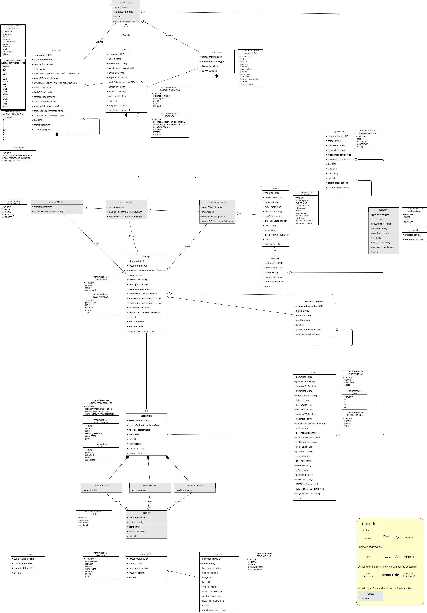

## [Unreleased] - 2022-04-04
### Added
- associations/me endpoint with OIDC security information
- persons POST endpoint 

#### Changed
- split person and associations into properties - ID and a aggragated person association object this allows for better reuse e.g. in POST where ID is not mandatory and in typed responses

# Changes in update 4.0 to 5.0 Education API Specification

The OOAPI-specification is finding more use cases. This causes the model to grow and also to change in certain aspects.

New area's of implementation are:
* Compatibility with RIO

## Models
the 4.0 model is based on:

